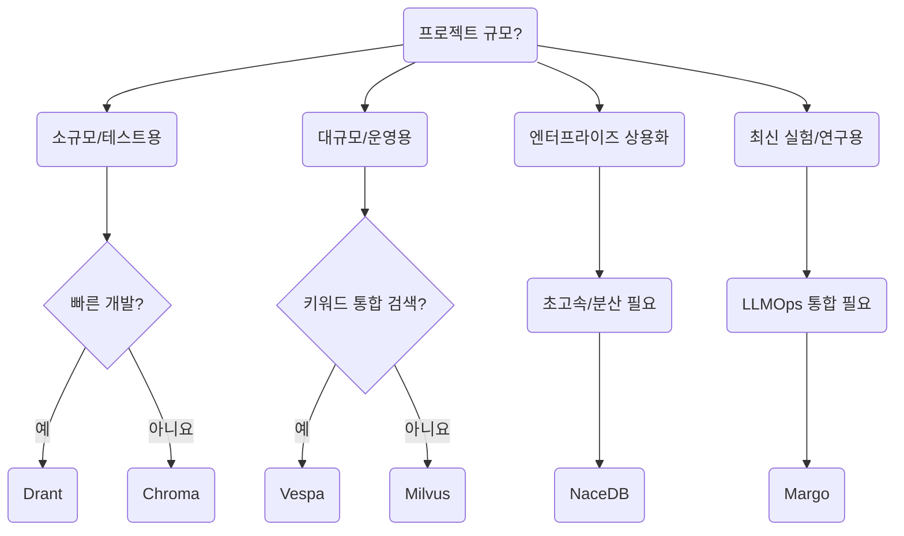

---
 **"벡터DB 선택 가이드 플로우차트"** 
# 🛤️ 벡터DB 선택 플로우차트

```
당신의 프로젝트 규모는?

 └▶ 소규모 / 프로토타입 (빠른 테스트용)
      └▶ "빠른 개발이 목표인가요?"
            └▶ 예 → ✅ Drant (초경량, 로컬 테스트 최적)
            └▶ 아니요 → ✅ Chroma (개발·학습용 기본기 탄탄)

 └▶ 중대형 / 운영 서비스용 (수십~수억 벡터)
      └▶ "검색 + 키워드 통합 검색이 필요한가요?"
            └▶ 예 → ✅ Vespa (벡터 + 키워드 하이브리드 최강)
            └▶ 아니요 → ✅ Milvus (대규모 순수 벡터 검색 최적)

 └▶ 엔터프라이즈 SaaS 또는 B2B 상용화
      └▶ "초고속 검색/분산 확장성 필요?"
            └▶ 예 → ✅ NaceDB (비즈니스 최적화 분산형)

 └▶ 최신 실험적 기술 도입/검증
      └▶ "AI 실험과 LLMOps 통합이 필요한가요?"
            └▶ 예 → ✅ Margo (최신 RAG/LLM 엔지니어링용)
```

---

# 📌  요약



---
# ✨ 최종 정리

|목적|추천|
|:--|:--|
|가볍고 빠른 테스트|**Drant**|
|튼튼한 소규모 RAG 시스템|**Chroma**|
|키워드+벡터 통합 대규모 검색|**Vespa**|
|순수 대규모 벡터 검색|**Milvus**|
|SaaS/B2B 엔터프라이즈 고성능|**NaceDB**|
|최신 기술/LLMOps 통합 실험|**Margo**|

---
- "빠르게 실습하고 싶은 경우" → **Chroma → Milvus** 로 옮겨가는 **2단계 전략**도 많이 사용합니다.
- 프로덕션 운영이 아니라면 대부분은 Chroma로도 충분히 RAG 성능을 실습할 수 있어요.

