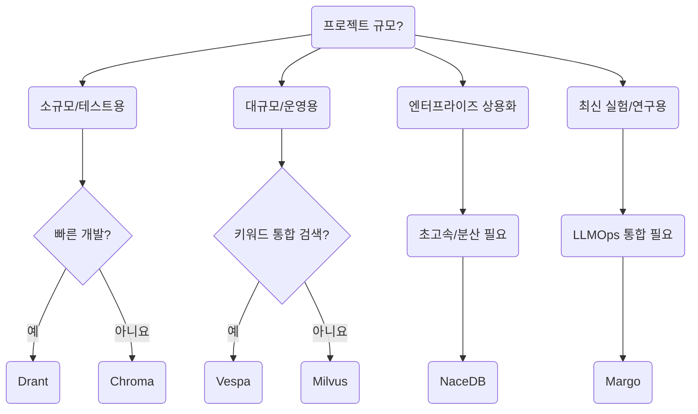
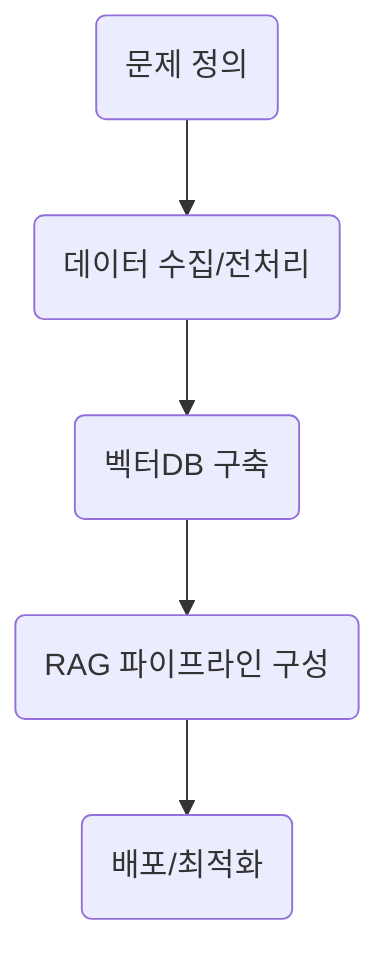

---
#  벡터DB 소개 & 평가

| 이름         | 간단 소개                                                  | 장점                                                                      | 단점/한계                                                        |
| :--------- | :----------------------------------------------------- | :---------------------------------------------------------------------- | :----------------------------------------------------------- |
| **Chroma** | 오픈소스 벡터DB. <br>특히 RAG 시스템에 최적화된 구조. <br>빠른 설치와 사용성 중심. | - 설치/사용 매우 간편<br>- Python 친화적 (LangChain과 잘 연동)<br>- 오픈소스, 무료           | - 대규모 운영(수억 개 이상 벡터)에는 성능 한계<br>- 클라우드 관리형 서비스 없음(직접 운영해야 함) |
| **Margo**  | AI 엔지니어링에 최적화된 최신 경량 벡터DB. <br>데이터/모델 실험 관리도 지원.       | - 빠른 인덱싱과 검색- 실험 추적 기능 내장<br>- 최신 프레임워크 연동(예: RAG+LLMOps)               | - 아직 매우 신생(성숙도 낮음)<br>- 커뮤니티 자료 부족                           |
| **Vespa**  | Yahoo가 개발한 대형 검색 엔진. <br>벡터+키워드 통합 검색에 강력.             | - 대규모 웹 수준 서비스에 최적<br>- 벡터+키워드 하이브리드 쿼리 지원<br>- 확장성과 안정성 매우 우수          | - 복잡한 설치 및 설정<br>- 러닝커브 있음(초심자 진입 장벽 높음)                     |
| **Drant**  | RAG용 초경량 인메모리 벡터DB. <br>빠른 테스트 및 프로토타입용.               | - 극단적으로 빠른 응답 속도<br>- 서버 없이 로컬에서 가볍게 사용 가능<br>- 개발자 친화적(특히 소규모 POC)     | - 메모리 기반 → 대규모 데이터에 부적합<br>- 프로덕션급 사용에는 제한                   |
| **NaceDB** | 비즈니스용 최적화된 분산형 벡터 데이터베이스. <br>속도와 분산 확장성 강점.           | - 초고속 검색 성능<br>- 수평 확장(Scale-out) 용이<br>- RAG, 추천 시스템에 적합               | - SaaS 위주(상용 서비스 중심)<br>- 오픈소스 버전 사용 제한적                     |
| **Milvus** | 가장 유명한 오픈소스 벡터DB 중 하나. <br>대규모 데이터셋을 위한 대표 솔루션.        | - 수십억 벡터 처리 가능<br>- GPU 가속 지원(속도 매우 빠름)<br>- 강력한 커뮤니티 & 상용 지원(→ Zilliz) | - 운영/구성 복잡도 있음<br>- 리소스 소모 크고 최적화 필요                         |

## 요약
- **빠른 프로토타입 →** Drant, Chroma
- **대규모 RAG/서버 운영 →** Milvus, Vespa
- **기업용 고속 서비스 →** NaceDB
- **최신 실험적/개발자용 →** Margo
##  추천 가이드

|목적|추천 DB|
|:--|:--|
|실험/개발/작은 규모 RAG|**Chroma**, **Drant**|
|대규모 RAG 운영|**Milvus**, **Vespa**|
|엔터프라이즈 상용화|**NaceDB**|
|신기술 기반 실험용|**Margo**|

## 참고
- Chroma → LangChain, LlamaIndex 기본 튜토리얼에서 가장 많이 사용.
- Milvus → 산업용 AI 서비스(추천 시스템, 검색 엔진)에서 다수 사용.
- Vespa → **"벡터+BM25 하이브리드"** 쿼리가 강력해서 대규모 검색 엔진 구축 시 매우 인기.
- Drant → 빠른 프로토타입(RAG 테스트용)에서 떠오르는 경량 대안.
- NaceDB → 엔터프라이즈 SaaS/클라우드 최적화라서 "빠른 대용량"에 강점.
- Margo → 요즘 뜨는 신생 프레임워크. AI/ML 기반 엔지니어링 워크플로우 통합 지향.
### 벡터DB 선택 플로우차트

```arduino
당신의 프로젝트 규모는?

 └▶ 소규모 / 프로토타입 (빠른 테스트용)
      └▶ "빠른 개발이 목표인가요?"
            └▶ 예 → ✅ Drant (초경량, 로컬 테스트 최적)
            └▶ 아니요 → ✅ Chroma (개발·학습용 기본기 탄탄)

 └▶ 중대형 / 운영 서비스용 (수십~수억 벡터)
      └▶ "검색 + 키워드 통합 검색이 필요한가요?"
            └▶ 예 → ✅ Vespa (벡터 + 키워드 하이브리드 최강)
            └▶ 아니요 → ✅ Milvus (대규모 순수 벡터 검색 최적)

 └▶ 엔터프라이즈 SaaS 또는 B2B 상용화
      └▶ "초고속 검색/분산 확장성 필요?"
            └▶ 예 → ✅ NaceDB (비즈니스 최적화 분산형)

 └▶ 최신 실험적 기술 도입/검증
      └▶ "AI 실험과 LLMOps 통합이 필요한가요?"
            └▶ 예 → ✅ Margo (최신 RAG/LLM 엔지니어링용)
```

###  요약



###  최종 정리

|목적|추천|
|:--|:--|
|가볍고 빠른 테스트|**Drant**|
|튼튼한 소규모 RAG 시스템|**Chroma**|
|키워드+벡터 통합 대규모 검색|**Vespa**|
|순수 대규모 벡터 검색|**Milvus**|
|SaaS/B2B 엔터프라이즈 고성능|**NaceDB**|
|최신 기술/LLMOps 통합 실험|**Margo**|

# 🛠️ RAG + 벡터DB 프로젝트 설계법
전체 구성은 다음 5단계:

|단계|주요 내용|
|:--|:--|
|1. 문제 정의|무엇을 위해 RAG를 구축할 것인가?|
|2. 데이터 수집/전처리|사용할 문서/데이터 준비 및 청크 분리|
|3. 벡터DB 선택 및 구축|Chroma, Milvus, Vespa 등 최적 DB 선택|
|4. RAG 파이프라인 설계|Retrieve → Augment → Generate 흐름 구성|
|5. 배포 및 최적화|실사용 환경 적용 & 성능 튜닝|

### 1. 문제 정의
#### 핵심 질문:
- **어떤 질문을 다룰 것인가?**
    - (예: 제품 매뉴얼 Q&A, 계약서 기반 법률 상담, 논문 기반 연구 보조 등)
- **RAG 시스템 사용자는 누구인가?**
    - (내부 직원? 외부 고객?)
- **필요 답변 수준은?**
    - (간단 답변 vs 전문적 상세 답변)
✅ 이 답변에 따라 이후 모든 설계 방향이 결정됩니다.

### 2. 데이터 수집/전처리
#### 필요한 작업:
- **문서 수집**
    - PDF, HTML, Word, Notion, DB 등 다양한 소스에서 가져오기
- **문서 분리**
    - **Text Splitter**로 문서를 청크 단위로 쪼개기
    - 문단, 페이지, 항목별 분리
✅ 좋은 청크 구조 = 좋은 검색 품질 (권장: 500~1500 tokens 단위)
### 3. 벡터DB 선택 및 구축

|조건|추천 DB|
|:--|:--|
|소규모, 빠른 개발용|**Chroma**|
|대규모 서비스용|**Milvus**, **Vespa**|
|고속 SaaS 구축|**NaceDB**|

#### 기본 구축 흐름
- **Embedding 모델 선택**: OpenAI, Huggingface 등
- **벡터화(Embedding)** 후 → 벡터DB 저장
- **메타데이터 추가**: (예: 소스 문서, 섹션명, 작성일 등)
✅ 벡터DB는 단순 저장소가 아니라,  **빠른 검색 + 유사성 기반 분류**의 역할
### 4. RAG 파이프라인 설계
#### 기본 흐름:
```
[1] 사용자가 질문 → 
[2] 질문을 임베딩 → 
[3] 벡터DB에서 관련 청크 검색 → 
[4] 검색 결과를 LLM에 함께 전달 → 
[5] LLM이 답변 생성
```
#### 각 단계 세부
- **Retriever** 설정:
    - 벡터 검색
    - (필요하면 키워드 BM25도 혼합)
- **Augmentation**:
    - LLMChainExtractor 사용해 문맥 압축
- **Prompt 최적화**:
    - 사용자 질문 + 검색된 청크 → 구조화된 프롬프트 생성
✅ **RAG 성능을 결정짓는 핵심은 Retriever 세팅과 프롬프트 설계!**

### 5. 배포 및 최적화
#### 방법
- API 서버 구축 (예: FastAPI + Uvicorn)
- 웹 프론트엔드 연결 (예: Next.js)
- 클라우드 배포 (AWS, GCP, Vercel 등)

#### 최적화 팁
- 검색 Top-K 튜닝 (ex: 3개 vs 5개 문서)
- 청크 크기 조정 (ex: 800 tokens → 1200 tokens)
- 프롬프트 간결성 개선
- 유사도 임계값 조정
✅ 목표는 **최소 비용으로 최대 품질의 답변 생성**입니다.

#  요약 플로우



## 예시 프로젝트 조합

|프로젝트 예시|조합|
|:--|:--|
|제품 매뉴얼 RAG|Upstage 파서 + Chroma + GPT-4o|
|논문 기반 연구 보조|Huggingface 문서 Splitter + Milvus + Claude 3|
|부동산 계약서 상담|Pinecone + GPT-4 Turbo|
|상용 SaaS 추천 엔진|NaceDB + RAG + OpenAI + React UI|

# 한 줄 정리
> **"RAG 시스템은 결국 데이터 → 검색 → 증강 → 답변"** 이 흐름을 얼마나 매끄럽고 정확하게 연결하는지가 성패를 좌우
